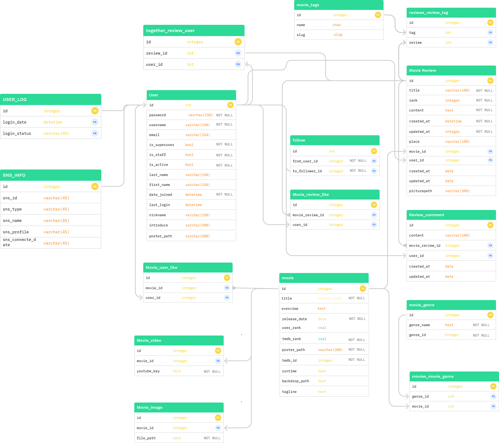

# Final_Project_README (Moviegram)

####  SSAFY 1학기 관통 프로젝트 - 대전 2반 김민현, 대전 2반 윤숙


## 1. 프로젝트 설명

영화를 선택하여 영화의 후기를 작성하고 공유하며 추천받는 (Moviegram) 웹사이트를 구현하였습니다. 사용자들의 후기를 공유하고 댓글을 작성하면서 영화에 대한 감상평로 후기를 공유할 수 있습니다.  또한 누군가 게시글에 댓글을 작성하면 이메일을 통해 알림기능을 제공합니다. 태그기능과 댓글검색 기능으로 보다 쉽게 글을 찾을 수 있고, FAQ 챗봇을 추가하여 사용에 불편함이 없게 사용자와 소통하고자 노력하였습니다. 


## 2. 팀원 정보 및 업무 분담 내역

- 김민현 [팀장]

  - 백엔드, 프론트

  - 업무 분담 

    - ERD 작성
    - 이메일 알람 기능 작성 
    
    - 검색 기능 구현
    - 태그 기능 구현 
    - 게시물 작성 구현 
    - DB 설계
    - 카카오 API 사용
    - TMDB API 사용
    - SNS 공유하기
    - N년전 영화 추천 

- 윤숙

  - 백엔드, 프론트

  - 업무 분담 

    - 요구사항 정의서 작성 및 계획 수립, 

    - accounts 기능 구현,

    - 추천 기능 구현,

    - Dialogflow을 이용한 챗봇기능 구현,

    - css 이용한 페이지 스타일 적용,
    
    - Javascript을 이용한 각종 이벤트 동적 처리, 

    

## 3. 목표 구현 및 실제 구현 정도


1.  초기 목표 구현


2. 구현결과 (+추가기능구현)

   - 메인페이지 구현 
   - 로그인 , 로그아웃 구현
   - 팔로우 , 팔로잉 구현
   - 프로필 페이지 구현
   - 추천 구현
   - 영화 리뷰 작성 구현
     - 카카오 API를 활용한 장소 입력
     - 태그 기능 
   - 리뷰 댓글 구현
   - 영화 탐색 페이지 구현
   - 영화 상세 페이지 구현
   - 회원 정보 변경 구현
   - 댓글 작성시 이메일 전송기능 구현 (+추가기능)
   - 태그 기반으로 댓글 검색 기능 기능 (+추가기능)
   - FAQ 챗봇 기능 구현 (+추가기능)
   - SNS 공유하기
   
   
   
   

## 3. 데이터 베이스 모델링

- 데이터베이스 상세 구조 (ERD)

   


## 4. 컴퓨터 구성 / 필수 조건 안내 

개발 머신에 다음 필수 구성 요소를 모두 설치했는지 확인합니다.

- Git : [다운로드 및 설치](https://git-scm.com/downloads) 다음 환경에서 버전 관리를 합니다.
- Django :  vscode을 통해 Django를 설치하고 원활한 코드 작성을 위해 django-extension을 설치합니다.
- python : VSCode에서 Python의 가상환경을 설정하여 구동합니다.
- sqlite3 : [다운로드 및 설치](https://www.sqlite.org/download.html) 데이터베이스를 설치합니다.
- API 사용
  - [google API OAuth 2.0](https://developers.google.com/identity/protocols/oauth2) - 구글 로그인 연동
  - [TMBD API](https://www.themoviedb.org/documentation/api) -영화 데이터 수집
  - [Kakao Map API](https://apis.map.kakao.com/) -지도데이터를 연동
  - [Dialogflow](https://dialogflow.cloud.google.com/) -  프로젝트를 생성하고 각 명령에 대한 기능을  따로 구현하여 제작하셔야 합니다.
- 각 라이브러리 사용 및 설치 버전은 requirements.txt 파일에 저장 해놓았습니다.


## 5. 필수 기능 설명

1. 영화 목록 조회

   리뷰 작성을 위해 영화를 검색하면 영화의 목록을 보여줍니다.

   

2. 리뷰 작성

   영화를 선택하면 해당 영화에 대한 리뷰를 작성 할 수 있습니다.

   리뷰에 사진을 추가할 수있고, 지도를 통해 시청했던 영화관을 선택할 수 있습니다.

   태그 기능 추가하여 `,`,`;` 으로 구분하여 여러개의 태그를 입력할수 있고 검색창 navbar에 있는 검색기능을 이용하면 태그및 리뷰에 대한 전체 결과를 불러올 수 있습니다.

   

   

3. 타임라인을 통해 전체 사용자의 리뷰 게시물을 한눈에 볼 수 있습니다. 마우스 호버를 통해 리뷰를 미리 확인 할 수 있습니다.


4. 리뷰 상세보기 가 가능하며 , sns 공유하기, 댓글달기,영화 상세 페이지조회, 

   작성자 프로필로 이동하기가 가능합니다


5. [메일 알람] 게시물에 댓글이 달리거나 , 팔로우가 늘었을 경우 메일로 알람 메시지를 보내줍니다.

   


6. 챗봇 기능

웹사이트의 사용법이나 문의 사항을 적으면 챗봇이 실시간으로 응답해줍니다.


7. 영화 추천 서비스
   1) 팔로워가 8점 이상준 영화 추천


2) 영화 관련사 (tmdb) 추천 가져오기

   

3. N년전 이번달 개봉한 영화(새로고침시 데이터 업데이트)

   

8. 영화 상세 보기 , 관련 영상을 확인 할 수 있으며, 영화 리뷰 및 비슷한 추천 영화를 확인 할 수 있습니다.

   sns공유 및 영화 찜하기도 가능 합니다.


9 . 개인 프로필 페이지

​	에디트 버튼, 팔로우 기능 , 팔로우 조회 ,리뷰 및 찜 한 영화리스트를 확인 할 수 있습니다.


## 6. 기타 : 문제 발생에 대한 해결책  - (윤숙)


1.  팔로우 추천 구현시 평점이 8점이상인 팔로우의 리뷰를 가져와야하는 데 팔로우 관계가 다다대 즉(models.ManyToManyField('self', symmetrical=False) )인 관계에서 어떻게 inner조인을 어떻게 데이터를 가져올 지 고민이 많았습니다.

   > #### in
   >
   > 주어진 iterable에서; 종종 목록, 튜플 또는 쿼리 집합입니다. 일반적인 사용 사례는 아니지만 문자열(반복 가능)이 허용됩니다.
   >
   > ```
   > Entry.objects.filter(id__in=[1, 3, 4])
   > Entry.objects.filter(headline__in='abc')
   > 
   > //same
   > SELECT ... WHERE id IN (1, 3, 4);
   > SELECT ... WHERE headline IN ('a', 'b', 'c');
   > ```

   > #### prefetch_related()
   >
   > 지정된 `QuerySet`각 조회에 대한 관련 개체를 단일 일괄 처리에서 자동으로 검색 하는 반환 합니다.
   >
   > 이것은 `select_related`둘 다 관련 개체에 액세스하여 발생하는 데이터베이스 쿼리의 홍수를 막도록 설계되었다는 점에서 와 유사한 목적을 갖지만 전략은 상당히 다릅니다.
   >
   > `prefetch_related`, 반면에 각 관계에 대해 별도의 조회를 수행하고 Python에서 '결합'을 수행합니다. 이를 통해 `select_related`에서 지원하는 외래 키 및 일대일 관계 외에 를 사용하여 수행할 수 없는 다대다 및 다대일 개체를 미리 가져올 수 있습니다

   - 참고 문서

     https://docs.djangoproject.com/en/3.2/ref/models/querysets/

   - 해결

     ```
     class User(AbstractUser):
         followings = models.ManyToManyField('self', symmetrical=False, related_name='followers')  
         nickname=models.CharField(max_length=30, verbose_name="닉네임")
         introduce=models.CharField(max_length=100, verbose_name="인사말")
         posterpath=models.ImageField(blank=True, upload_to='profiles/', verbose_name="프로필사진", null=True, )
     
     ```

     

     ```
     def recommendation(request, username):
     
         if request.user.is_authenticated:
             person = get_object_or_404(get_user_model(), username=username)
             
             followList =person.followings.all()
             recomendation_followers=Review.objects.filter(rank__gte=8, user__in=followList).prefetch_related('user')
     
     
     ```

     

2. 챗봇 기능 구현시 문제발생

   FAQ 챗봇 기능을 구현 하려고 하려 검색했는 데 생각 보다 많은 사이트에서 텐션플로우를 이용해서 어렵게 구현 되어 이해하기가 힘들었습니다. 그러던 와중에 구글의  DialogFlow api를 발견했고 검색어 학습이 API를 통해서 이뤄지기 때문에 구현이 간편하고 복잡한 연동과정이 없었습니다.

   그러나 Django를 통해 기본 서버를 구축하고, fulfillment 기능을 통해 서버와 연동하는 방법을 몰라서 고생을 좀 했습니다. 

   

   - 챗봇의 기능이 구현하기 위해서 참고했던 영상

     https://www.youtube.com/watch?v=FzmtQ3wR7q8&t=1s

     https://www.youtube.com/watch?v=WLUEghtVS9k

   - 참고했던 문서들

     https://stackoverflow.com/questions/45349095/integrating-api-ai-chatbot-on-a-website

     https://zephyrnet.com/ko/Python-Django%EB%A5%BC-%EC%82%AC%EC%9A%A9%ED%95%98%EB%8A%94-%EC%B1%97%EB%B4%87%EC%9D%98-dialogflow-tutorial-%ED%8E%98%EC%9D%B4%EC%A7%80-%EB%A7%A4%EA%B9%80-%EA%B8%B0%EB%8A%A5/

   

   첫번째 문서를 읽고 웹이랑 연동시에 바로 연동이 안된다는 것에 좌절했지만, 3년된 오래된 정보임을 알게되었고, 두번째 문서를 찾게되어 최근 Dialogflow Messenger가 베타서비스로 출시 되었다는 정보를 stackoverflow에 찾아서 새로나온 기능을 적용해보았습니다.

   - 참고했던 문서

     https://stackoverflow.com/questions/51113401/how-to-integrate-dialogflow-with-website

     https://stackoverflow.com/questions/68416358/dialogflow-messenger-access-control

   ```python
   @csrf_exempt
   def webhook(request):
       if request.method == 'POST':
           req = json.loads(request.body)
   
           #request의 action을 파악합니다.
           action = req.get('queryResult').get('action')
           
           #params를 획득합니다.
           params = req.get('queryResult').get('parameters')
   
           # action에 따라서 이동합니다.
           if action == 'recommendation_create':
               return recommendation_create(params)
     
             
       
   def recommendation_create(params):
       
     
       movies = Movie.objects.all()
       item = random.choice(movies)
   
       item.save()
       
       
       response = {
           
           "responseId": "691472e4-9dc1-4d58-bbbd-46f0e6107148-0c9356c1",
           "queryResult": {
               "queryText": "추천",
               "parameters": {
               "followrecommendation": "추천"
               },
               "fulfillmentText":  '추천영화 {}는 어떠세요?'.format(item.title),
               "outputContexts": [
               {
                   "name": "projects/newagent-vdhg/agent/sessions/b262b96f-8a00-4cd5-3c09-0ddf0584b2e9/contexts/recommendation_create-followup",
                   "lifespanCount": 1,
                   "parameters": {
                   "no-match": 1,
                   "no-input": 0
                   }
               }
               ]
           }
       }
       return JsonResponse(response, safe=False)
   ```

   

   

   - fulfilment 기능을 사용하려고 하는데 https보안 문제 때문에 번번이 막힘 (미해결)

     

   

   

3. accounts의 user모델의 테이블이 생성 되지 않고 makemigrations로 생성이 안되는 문제

   

   

   

   - 참고문서

     https://stackoverflow.com/questions/35494035/django-migrate-doesnt-create-tables/43677713#43677713

   - 해결

     ```bash
     python manage.py migrate --fake APPNAME zero
     ```

   

4. env 사용하여 키숨기기

   배포시 사용했던 API 키를 숨겨야함으로 env를 작성하여 키의 내용을 숨겼다.

   - 해결

     ```
     pip install python-decouple
     ```

     

   - 참고 문서

     https://hwan-hobby.tistory.com/181

     

   초기 데이터 생성 

   장르 데이터가 데이터베이스 초기에 데이터의 값이 들어 있어야 게시물이 작성 가능합니다.  장르데이터를 일일히 데이터베이스를 초기화 할때마다 날려야 하는 불편함이 있었기에 다음과 같이 해결했습니다.

   ```
   기존 Movie 데이터
   Action          28
   Adventure       12
   Animation       16
   Comedy          35
   Crime           80
   Documentary     99
   Drama           18
   Family          10751
   Fantasy         14
   History         36
   Horror          27
   Music           10402
   Mystery         9648
   Romance         10749
   Science Fiction 878
   TV Movie        10770
   Thriller        53
   War             10752
   Western         37
   ```

   - 해결

      movies앱에 fixture라는 폴더를 생성 위의 데이터를 json형식의 데이터로 변환하여 넣어주고 

     다음 명령을 실행하여 초기데이터를 넣어 줬다.

     ```bash
     python manage.py loaddata <파일명>
     ```

     

   - 참고 문서

     참고한 문서

     https://docs.djangoproject.com/en/1.10/howto/initial-data/

     https://cjh5414.github.io/django-fixture-runpython/


## 8.기타 (김민현)

- 데이터 설계의 중요성을 깨달았습니다. ERD 구조가 명확하니 , 모델관계를 구성하기 수월했습니다.

  추후 추가 기능을 넣기 위해 추가한 테이블이 있긴 하지만, 거의 초창기 ERD 설계를 따라 설계 했습니다.

- git의 branch를 사용하면서 충돌이 나서 새로운 repository를 만드는등의 일이 있었습니다

- 구조적으로 코드를 설계하지 않아 유지 보수에 어려움을 느꼈습니다. 특히 CSS의 경우 템플릿을 많이 응용하다 보니 같은 태그가 여러군데서 정의 되어 우선순위 때문에 원하는대로 동작 하지 않을때가 있었습니다

- 배포시 오류 발생으로 인해 배포에 어려움을 겪었습니다.

- API를 활용하여 다양한 아이디어를 실행 할 수 있었습니다.

- django를 사용하면서 테이블간의 관계를 더 명확히 이해 하고 사용 할 수 있게 되었습니다.

  - 특히 태그 등록과 검색 기능을 구현할때, 디테일 페이지를 구현 할때 많이 느꼈습니다.

- 전체적인 구상을 완성하고 세세한 디테일 작업을 진행했는데, 디테일 작업이 생각보다 오래 걸려, 조금 더 충분한 여유를 가지고 진행 했어도 좋을것 같다는 생각이 들었습니다.

  
